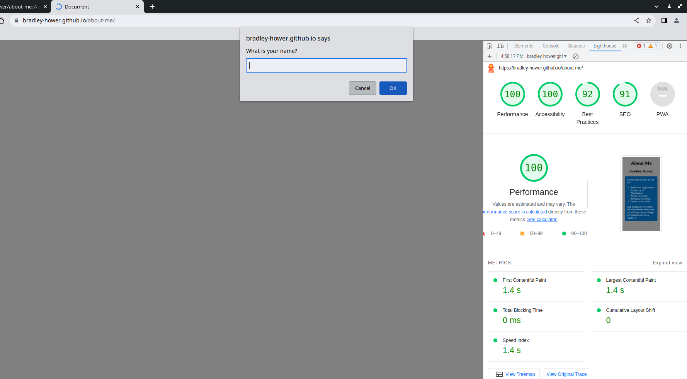

# LAB - 02

## About Me

A site telling you a bit more about me. Here you can take a quiz - an interactive way to get to know me.

### Author: Bradley Hower

### Links and Resources

* [submission PR](http://xyz.com)
* Any Links you used as reference

### Lighthouse Accessibility Report Score

### Reflections and Comments

My experience thus far has been good. I think the key point for me is to make notes of concepts or pieces of code I am less familiar with. This will help me to later come back to these for review and will maximize my learning. Moreover, it allows me to learn things that perhaps I won't necessarily be tested on.

In regards to what I want to learn, the further along I get in the process of understanding what is industry standard, I think it will be easier to know where I want to go with my learning.

Currently, a regular weekly review regarding what I want to learn, with reflection on what I have learned thus far I think is a good plan. This will also help me to orient myself and test my understanding of the concepts.
