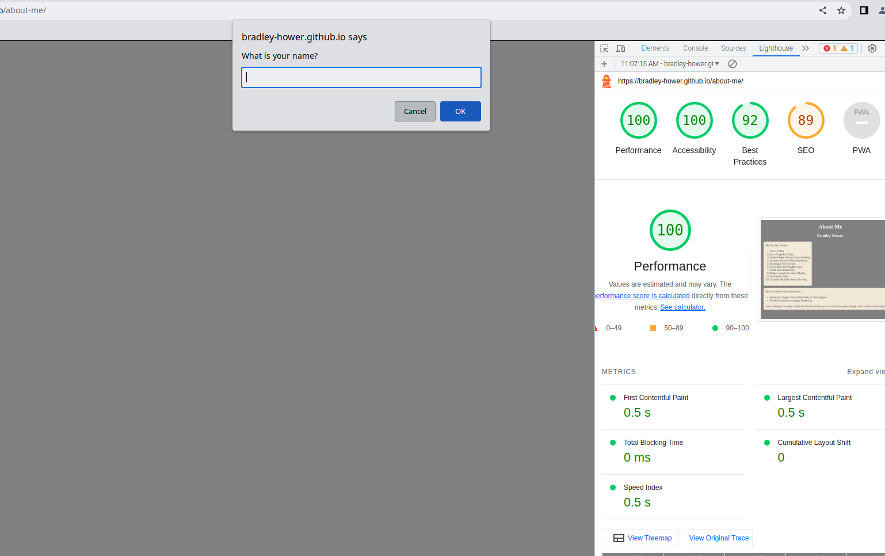

# LAB - 02

## About Me

A site telling you a bit more about me. Here you can take a quiz - an interactive way to get to know me.

### Author: Bradley Hower and Isai Chaidez. Navigator: Bradley Hower. Driver: Isai Chaidez

### Links and Resources

* [submission PR](http://xyz.com)
* Any Links you used as reference

### Lighthouse Accessibility Report Score

### Reflections and Comments

Lab 02
My experience thus far has been good. I think the key point for me is to make notes of concepts or pieces of code I am less familiar with. This will help me to later come back to these for review and will maximize my learning. Moreover, it allows me to learn things that perhaps I won't necessarily be tested on.

In regards to what I want to learn, the further along I get in the process of understanding what is industry standard, I think it will be easier to know where I want to go with my learning.

Currently, a regular weekly review regarding what I want to learn, with reflection on what I have learned thus far I think is a good plan. This will also help me to orient myself and test my understanding of the concepts.

Lab 03
How do you think your prior life and professional experience will help you in this new endeavor?
My prior work in finance required me to be very organized with hyper attention to detail. This no doubt will be very useful for coding, as even the smallest mistake can break code. I found the lab today to be fun. It was a fun challenge to work through. It's great to be able to use what we learn and then add on top of it a bit of a push, requiring us to work to expand beyond the course material a little. A very useful skill to develop with strength.

Lab 04
Coding together with others brings up unique challenges. People have different ways of writing code and each person has their own blind spots. I am seeing that being able to detect these blind spots and work through them is important in being able to achieve the best outcomes. In general, I don't have difficulty communicating. It is a matter of just learning to do the actual writing with others.

Lab 05 
I got stuck on one of the bento problems for much longer than I should have and it was driving me crazy. I finally figured it out after simplifying. I overthink things, always trying to dive so deep when sometimes the fish is just below the surface. I also find I really need to have enough fuel in me. Otherwise, I can not think clearly.

Lab 06
The struggle was there. But it wasn't so bad. I think the critical thing I need to keep in mind is to not over complicate everything. There are times when the solution is one layer simpler than I think it is. I think I have to make another loop or object, etc, but actually, the answer is much closer. Breaks are very important too.

It is very exciting to be able to inject elements right into the DOM via JavaScript. I can see that this will open a lot more possibilities. The way JavaScript is coded with methods I find is a bit weird and can make it a bit confusing as the delineation isn't so clear between it and other purposes, such as pulling up a property. Also, dot notation vs bracket use, depending on the context. It seems it would be better to be consistent in convention.

Learning about the STAR method in the career portion of this class was good for me I think. Having that structure I think is very helpful. I feel me speaking too much maybe is undesired, but it appears I am wrong. This was some great insight.

Lab 07

Things are becoming easier now. Having a broader context makes it easier. Discovered I ran into an issue that is very strange. I could not run past a certain number of loops on one of my loops. I am starting to think my system might have had memory issue there, but no matter, I found an alternative way to make it work. Taking breaks indeed helps.

Lab 08

Sleep is good. But perhaps so is taking things slowly. I forget what other elemnents already exist sometimes and code without the full perspective. I still think flexbox is problemmatic on multiple layers. If you just want to use it on a single layer, sure, can be done. But if you want a flexbox within a flexbox, it really doesn't work well. 

Lab 11

I think perhaps regular review of concepts is helpful. It will allow me to more easily pull the structures out of my head when needed. I am also still falling into the trap of only looking for the solution to a bug in one place. I need to review all my code once the obvious places have been verified. 

Lab 12

Realizing that I should not make an variable a plural form will save a lot of pain. Continuing to push for a schedule and become more regular in my studying.

Lab 13

Learning the ins and outs of how the object stances work is interesting. I learned that variables can be attached to instances or not. These are not separate areas of JS. This was helpful and allowed me to do some keen things with the chart re-rendering. I also came to understand better how JSON works. Very interesting. It's great to see how string storage works and how, as needed, objects can be pulled out and reconstructed as instances. I feel this gives me a start to much more of how the web works. Growing up, I had always heard about JSON files but didn't really understand what they did. I think trying to learn out of context would have made it confusing. It's exciting to realize all the useful things I am entering into now.

Lab 14

Today I learned the ins and outs of property dot and bracket notation. It is quite a bit, but after some thought, it makes sense. To fit one's mind into that framework is difficult, but workable once there. Things are going well overall. I have a clear understanding of how helper functions and constructors work. The reading on psychological safety was a good one. It made me realize the importance of creating a friendly atmosphere to get people engaged. 
